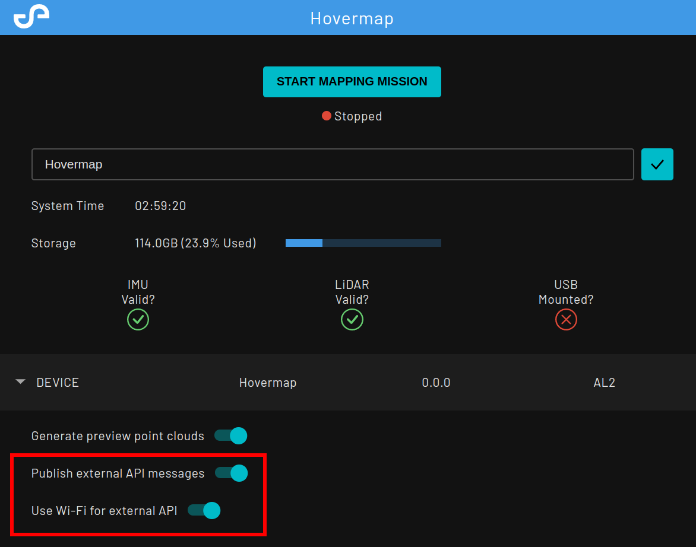
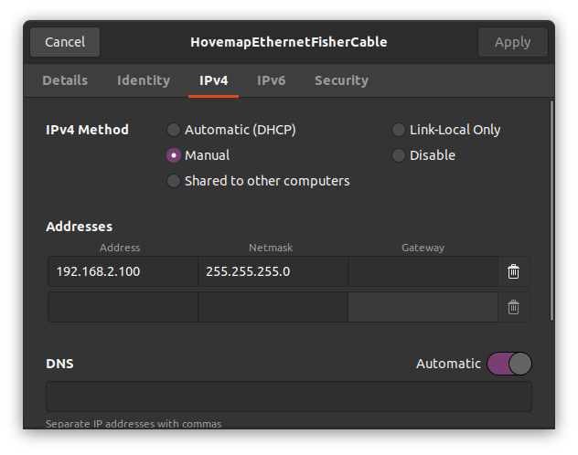
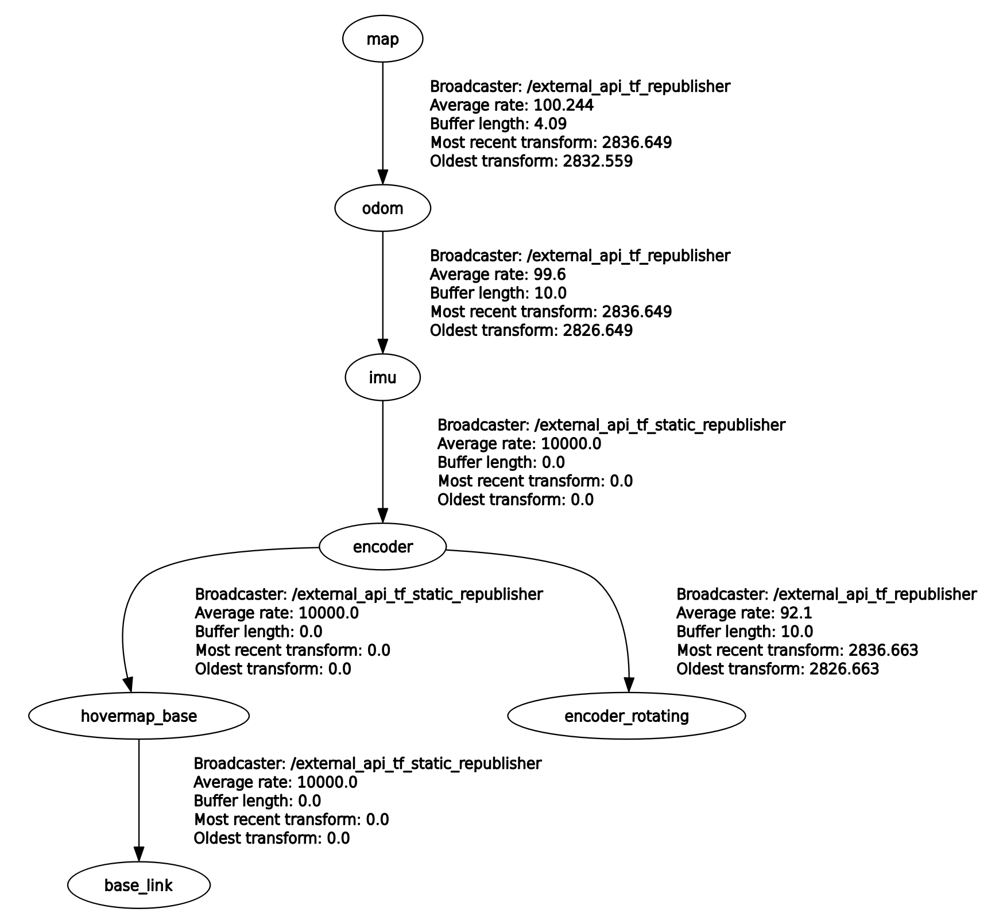

# Hovermap ROS API

ROS 1 meta-package to get access to the Hovermap online data through a client computer.

## Pre-requisites

The Hovermap API setup requires:

- an Emesent Hovermap
- a client computer running Ubuntu 20.04 LTS with ROS 1 Noetic installed
- an Emesent Hovermap connected to the client computer with either Wi-Fi, a Hovermap ST Fischer-to-Ethernet interface,
or a USB-to-Ethernet adaptor

## Quick Start

### 1. Install dependencies

1. Install ROS noetic: <http://wiki.ros.org/noetic/Installation/Ubuntu>
2. Install project dependencies and clone the project

```bash
sudo apt update
sudo apt install chrony python3-catkin-tools -y
mkdir -p hovermap_ros_api/src
cd hovermap_ros_api/src
git clone git@github.com:Emesent/hovermap_ros_api.git
rosdep install --from-paths src --ignore-src --rosdistro=${ROS_DISTRO} -y
python3 -m pip install -r mule_bridge/requirements.txt
```

### 2. Enable the Hovermap API

1. Power on Hovermap
2. Connect to Hovermap via the Wi-Fi access point; SSID named after the Hovermap serial number (e.g. `st_0001`)
3. Enable the external API through the Hovermap Web UI
    1. Visit <http://hover.map> on a web browser
    2. Switch on the "Publish external API messages" option

    

    **Note**: if the option does not appear you will need to contact Emesent about an updated entitlement file.
4. If you would like to use the external API over ethernet, turn off the "Use Wi-Fi for external API" switch
5. Power cycle Hovermap and verify the external API is enabled by connecting as described below

### 3. Connect to the Hovermap

The API is configured to connect over either Wi-Fi or Ethernet on boot time with one of the following interfaces 
with their specific configurations:

| Interface                 | ip_prefix   | Hovermap address | Client address   | Netmask       |
|---------------------------|-------------|------------------|------------------|---------------|
| ST Fischer-to-Ethernet    | 192.168.2.0 |    192.168.2.115 |    192.168.2.100 | 255.255.255.0 |
| USB-to-Ethernet           | 192.168.3.0 |    192.168.3.115 |    192.168.3.100 | 255.255.255.0 |
| Wi-Fi                     |    10.9.0.0 |         10.9.0.1 |        10.9.0.99 | 255.255.255.0 |

1. Connect to the Wi-Fi access point again or plug in the physical connection from your machine to the Hovermap if you are using Ethernet. 
2. Set up a network profile with a manual static IP as specified in the "Client address" from the table



3. Check the connection to the Hovermap is setup correctly by pinging Hovermap

```bash
ping -c 5 192.168.2.115 # Hovermap address as specified in table above
```

4. Edit the [mule.yaml](hovermap_api/config/mule.yaml) config file to fill out these values for the network interface 
used for your connection.

```yaml
mule_network: "your_network_interface" # The client computer's active network interface name
ip_prefix: "192.168.2.0"               # as in the table
ip_netmask: "255.255.255.0"            # as in the table
```

5. Build and launch the Hovermap API

```bash
catkin build hovermap_api
source <path_to_workspace>/install/setup.bash
roslaunch hovermap_api api.launch
```

6. Verify the API connection works successfully by checking the rosout and getting this message:

```yaml
started core service [/rosout]
process[hovermap_api_mule-2]: started with pid [239]
[INFO] [1689641473.095754]: Delay started (give subscribers time to connect)
[INFO] [1689209676.101692]: Delay finished
[INFO] [1689209676.609904, 2930.950000]: Added peer st_0001 at tcp://192.168.2.115:{49184,49189}
[INFO] [1689209676.613040, 2930.959000]: Connected to st_0001 at tcp://192.168.2.115:49189
```

``` bash
$ rostopic list
/hovermap_api_mule/status
/odometry
/perception_configuration
/pointcloud
/rosout
/rosout_agg
/tf
/tf_static
```

7. Start a Mapping mission either on the Web UI or through Commander

## API ROS topics

### Received from Hovermap

| Topic name                | Type                   | Description                      | Update Rate (Hz)  | Notes |
|---------------------------|------------------------|----------------------------------|-------------------|-------|
| /hovermap_api_mule/status | mule_bridge_msgs/Status| Internal mule status             | 1                 |
| /tf_static                | tf_msgs/TFMessage      | Static transforms                | Once (latched)    | |
| /tf                       | tf_msgs/TFMessage      | Non-static transform             | Variable          | |
| /odometry                 | nav_msgs/Odometry      | SLAM corrected odometry          | 100               | |
| /pointcloud               | sensor_msgs/PointCloud2| Occupancy grid for navigation    | 1                 | 256x256x256 grid; 0.25m resolution by default |

### Sent from client

| Topic name                | Type                   | Description                        |
|---------------------------|------------------------|------------------------------------|
| /perception_configuration | std_msgs/String        | Occupancy grid config YAML endpoint|

### Topic details

1. Transform tree (tf and tf_static)
    - The TF contains the depicted below
    - It follows [REP 105](https://www.ros.org/reps/rep-0105.html) convention
    - `hovermap_base` is the external reference point on hovermap and it is located as depicted below
    - `hovermap_base` and `base_link` are coincident when hovermap is attached to an unsupported robotic platform
    - `base_link` referenced the robot reference axis for navigation and control purposes when attached to a supported robotic platform

Tf tree             |  Reference axis
:-------------------------:|:-------------------------:
 | 


2. Odometry (/odometry)
    - Local SLAM corrected odometry from `odom` to `hovermap_base`
    - If global (mission) corrected odometry is required the `map->odom` transform should be applied to the `odometry` value
    - Topic covariance is not populated

3. Occupancy grid (/pointcloud)
    - Fixed size 3D occupancy grid describing local obstacles detected by the Hovermap
    - It is meant to be used for navigation purposes only

4. Perception configuration (/perception_configuration)
    - The occupancy grid's parameters can be configured before a mission is launched. See [relevant section](#perception-configuration) for details
    - The configuration is sent to the Hovermap as a string representing a YAML file. A node is provided to do this.
    - The custom configuration is only used when using external_api, and is persistent across runs

## Time Synchronisation

The Hovermap is configured to act as an NTP server to allow API users synchronise the client's clock to the Hovermap's by:

1. Synchronise the client with the Hovermap by editing `/etc/chrony/chrony.conf`
    - add `server 192.168.2.115  iburst`
    - remove/comment any other `server` or `pool` directives the file
2. Start chrony as a service with `service chrony start`
3. Check the offset between the clocks with `chronyc tracking`

```
Reference ID    : C0A80273 (192.168.2.115)
Stratum         : 11
Ref time (UTC)  : Wed Jul 12 05:49:04 2023
System time     : 0.000000002 seconds slow of NTP time
Last offset     : +0.000003220 seconds
RMS offset      : 0.000048081 seconds
Frequency       : 3.325 ppm slow
Residual freq   : +0.001 ppm
Skew            : 0.801 ppm
Root delay      : 0.000319398 seconds
Root dispersion : 0.002432903 seconds
Update interval : 64.0 seconds
Leap status     : Normal
```

**Note** : Chrony synchronises clocks by slowly skewing towards the target clock. Consequently a large offset between
clocks may take a while to converge. In this case, run `sudo chronyc -a makestep` to force chrony to discontinuously change the time to the server time.

## Perception configuration
The Hovermap ROS API publishes an occupancy grid that can be configured for your specific application. 

### Parameter details

| Parameter          | Type  | Description                                     |
|--------------------|-------|-------------------------------------------------|
| on_hit             | int   | Voxel value increase on hit                     |
| on_miss            | int   | Voxel value increase when missed                | 
| occupied_threshold | int   | Value above which voxel is considered occupied  |
| occupied_min       | int   | Minimum value for voxel                         |
| occupied_max       | int   | Maximum value for voxel                         |
| voxel_size         | float | Side length of an individual voxel in the grid  |
| dimensions/x       | int   | Number of voxels in the x axis of the grid      | 
| dimensions/y       | int   | Number of voxels in the y axis of the grid      |
| dimensions/z       | int   | Number of voxels in the z axis of the grid      |

The occupancy grid holds unitless occupancy values that represents how likely it is to be occupied.

When a LiDAR point is detected in a voxel, the occupancy is increased by `on_hit`. When the LiDAR point
is raycasted to, the occupancy value of the voxels it did not hit is increased by `on_miss`.

Above an occupancy value of `occupied_threshold`, that voxel is considered occupied for navigation purposes.

The occupancy value is clamped within the [`occupied_min`, `occupied_max`] range

### Notes

#### Performance
The parameters chosen, in particular the dimensions and the voxel size, can affect the performance 
at which the Hovermap's perception system runs. 

To ensure nominal performance, the total number of voxels should be less than 70 million and the `voxel_size` 
should be between `0.05` and `0.25`.

#### Persistency
The configuration is *persistent* between boots, so it only needs to be configured once. 
Sending an empty config to the Hovermap will reset the configuration to the default.

## Changing perception configuration

1. Update the parameters in the [`perception_config.yaml`](./src/hovermap_api/config/perception_config.yaml) file in 
the hovermap_api config directory

2. Build the hovermap_api package with `catkin build hovermap_api`

3. Configure the Hovermap ROS API and ensure connection is established as per the Quick Start instructions

4. Run the perception configuration node with `rosrun hovermap_api configure_perception`

5. Start a mapping mission to validate the changes to the occupancy grid
