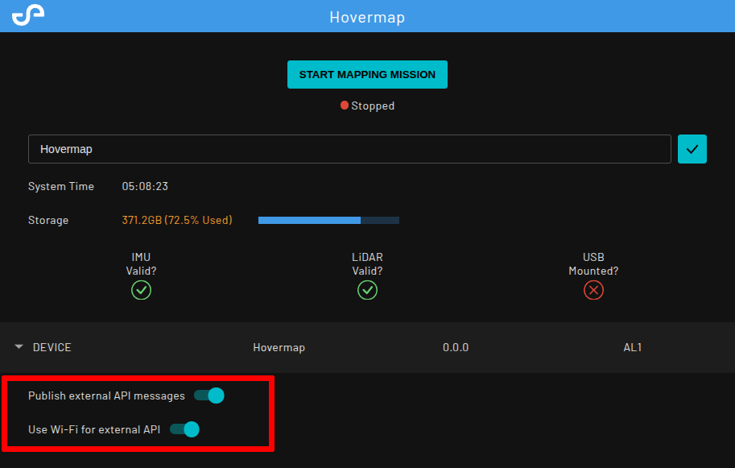
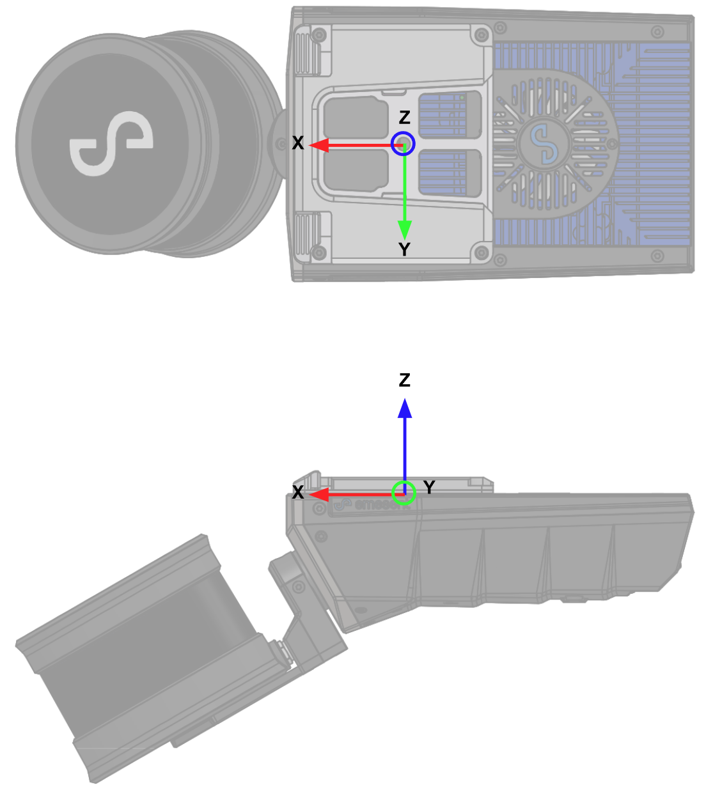

# Hovermap ROS API

ROS 1 meta-package to get access to the Hovermap online data through a client computer.

## Pre-requisites

The Hovermap API setup requires:

- an Emesent Hovermap with Cortex >= 4.0.2
- a Ubuntu 20.04 LTS environment with ROS 1 Noetic installed (Dockerfile and scripts are provided to generate this if required)
- an Emesent Hovermap accessible via:
    - Wi-Fi, or
    - a USB-to-Ethernet adaptor, or
    - a Hovermap ST Fischer-to-Ethernet interface

## Setup

### 1. Enable the API on the Hovermap

1. Power on Hovermap
2. Connect to Hovermap via the Wi-Fi access point; SSID named after the Hovermap serial number (e.g. `st_0001`)
3. Enable the external API through the Hovermap Web UI
    1. Visit <http://hover.map> on a web browser
    2. Switch on the "Publish external API messages" option

    

    **Note**: if the option does not appear you will need to contact Emesent about an updated entitlement file.
4. If you would like to use the external API over ethernet, turn off the "Use Wi-Fi for external API" switch
5. Power cycle Hovermap and verify the external API is enabled by connecting as described below

### 2. Connect to the Hovermap

The API is configured to connect over either Wi-Fi or Ethernet on boot time with one of the following interfaces 
with their specific configurations:

| Interface                 | ip_prefix   | Hovermap address | Client address   | Netmask       |
|---------------------------|-------------|------------------|------------------|---------------|
| ST Fischer-to-Ethernet    | 192.168.2.0 |    192.168.2.115 |    192.168.2.100 | 255.255.255.0 |
| USB-to-Ethernet           | 192.168.3.0 |    192.168.3.115 |    192.168.3.100 | 255.255.255.0 |
| Wi-Fi                     |    10.9.0.0 |         10.9.0.1 |        10.9.0.99 | 255.255.255.0 |

1. Connect to the Wi-Fi access point again or plug in the physical connection from your machine to the Hovermap if you are using Ethernet. 
2. Set up a network profile with a manual static IP as specified in the "Client address" from the table

    

3. Check the connection to the Hovermap is setup correctly by pinging Hovermap

    ```bash
    ping -c 5 192.168.2.115 # Hovermap address as specified in table above
    ```

### 3. Setup the client

We provide a Dockerfile and scripts in the [docker](docker) folder to assist with the image generation and container running.

1. Clone the repository

    ``` bash
    git clone git@github.com:Emesent/hovermap_ros_api.git
    ```

2. Edit the [mule.yaml](hovermap_api/config/mule.yaml) config file to fill out these values for the network interface 
used for your connection.

    ```yaml
    mule_network: "your_network_interface" # The client computer's active network interface name
    ip_prefix: "192.168.2.0"               # as in the table
    ip_netmask: "255.255.255.0"            # as in the table
    ```

3. Build the Dockerfile and run the container

    ``` bash
    cd hovermap_ros_api
    ./docker/build_docker
    ./docker/run_docker
    ```

4. Run the client and Verify the API connection works successfully by checking the rosout and getting this message:

    ```bash
    started core service [/rosout]
    process[hovermap_api_mule-2]: started with pid [239]
    [INFO] [1689641473.095754]: Delay started (give subscribers time to connect)
    [INFO] [1689209676.101692]: Delay finished
    [INFO] [1689209676.609904, 2930.950000]: Added peer st_0001 at tcp://192.168.2.115:{49184,49189}
    [INFO] [1689209676.613040, 2930.959000]: Connected to st_0001 at tcp://192.168.2.115:49189
    ```

    On a different shell check the `rostopic list` output is:

    ``` bash
    /cortex/download_scan
    /cortex/hovermap_status
    /cortex/lidar/corrected
    /cortex/mule_bridge/status
    /cortex/occupancy_grid_map/configuration
    /cortex/occupancy_grid_map/data
    /cortex/odometry
    /cortex/scan_download_successful
    /cortex/scan_names_request
    /cortex/scan_names_response
    /cortex/set_scan_prefix
    /cortex/start_scan
    /cortex/stop_scan
    /cortex/tf
    /cortex/tf_static
    /rosout
    /rosout_agg
    ```

### 4. Start a Mapping mission

1. Start a Mapping mission either on the Web UI or through Commander. 
2. Once the mission is fully running, check there is data coming through the topics (e.g. `rostopic hz /cortex/occupancy_grid_map/data`).

## API ROS topics

### Received from Hovermap

| Topic name                        | Type                   | Description                      | Update Rate (Hz)  | Notes            |
|-----------------------------------|------------------------|----------------------------------|-------------------|------------------|
| cortex/mule_bridge/status         | mule_bridge_msgs/Status| Internal mule status             | 1                 | in `/odom` frame |
| cortex/lidar/corrected            | sensor_msgs/PointCloud2| SLAM corrected lidar point cloud | 20                | in `/odom` frame |
| cortex/occupancy_grid_map/data    | sensor_msgs/PointCloud2| Occupancy grid for navigation    | 1                 | 160x160x160 grid; 0.25m resolution by default |
| cortex/odometry                   | nav_msgs/Odometry      | SLAM corrected odometry          | 100               |                  |
| cortex/tf                         | tf_msgs/TFMessage      | Non-static transform             | Variable          |                  |
| cortex/tf_static                  | tf_msgs/TFMessage      | Static transforms                | Once (latched)    |                  |
| cortex/hovermap_status            | hovermap_api_msgs/HovermapStatus | Hovermap and current scan status | 1        |                  |
| cortex/scan_names_response        | hovermap_api_msgs/ScanInformationList | List of scans stored on the Hovermap newest to oldest | On request | Reply to `cortex/scan_names_request` |
| cortex/scan_download_successful   | std_msgs/Bool          | Outcome of a scan download: `true` on success, `false` on failure | On download completion | Published after each `cortex/download_scan` request finishes |

### Sent from client

| Topic name                                | Type                   | Description                        |
|-------------------------------------------|------------------------|------------------------------------|
| cortex/occupancy_grid_map/configuration   | std_msgs/String        | Occupancy grid config YAML endpoint|
| cortex/scan_names_request                 | std_msgs/Empty         | Request the list of stored scans   |
| cortex/set_scan_prefix                    | std_msgs/String        | Set the prefix used to name new scans |
| cortex/start_scan                         | std_msgs/Empty         | Start a mapping scan                |
| cortex/stop_scan                          | std_msgs/Empty         | Stop the current mapping scan       |
| cortex/download_scan                      | std_msgs/String        | Download a stored scan by name      |

### Topic details

1. Transform tree (`cortex/tf and cortex/tf_static`)
    - The TF contains the depicted below
    - It follows [REP 105](https://www.ros.org/reps/rep-0105.html) convention
    - `hovermap_base` is the external reference point on hovermap and it is located as depicted below
    - `hovermap_base` and `base_link` are coincident when hovermap is attached to an unsupported robotic platform
    - `base_link` referenced the robot reference axis for navigation and control purposes when attached to a supported robotic platform

    Tf tree                                           |  Reference axis
    :------------------------------------------------:|:----------------------------------------------------------:
    | | |


2. Odometry (`cortex/odometry`)
    - Local SLAM corrected odometry from `odom` to `hovermap_base`
    - If global (mission) corrected odometry is required the `map->odom` transform should be applied to the `odometry` value
    - Topic covariance is not populated

3. Occupancy grid (`cortex/occupancy_grid_map/data`)
    - Fixed size 3D occupancy grid describing local obstacles detected by the Hovermap
    - It is meant to be used for navigation purposes only

4. LiDAR corrected point cloud (`cortex/lidar/corrected`)
    - SLAM corrected LiDAR data with the following packet structure:

    ``` c++
    POINT_CLOUD_REGISTER_POINT_STRUCT(
        PointXYZItime,
        (float, x, x)(float, y, y)(float, z, z)
        (double, timestamp, timestamp)
        (float, intensity, intensity)
        (std::uint8_t, ring, ring)
        (std::uint8_t, returnNum, returnNum)
    );
    ```

5. Perception configuration (`cortex/occupancy_grid_map/configuration`)
    - The occupancy grid's parameters can be configured before a mission is launched. See [relevant section](#perception-configuration) for details
    - The configuration is sent to the Hovermap as a string representing a YAML file. A node is provided to do this.
    - The custom configuration is only used when using external_api, and is persistent across runs

6. Hovermap status (`cortex/hovermap_status`)
    - Reports the current status of the Hovermap and any scan in progress. The `HovermapStatus` message contains:
        - `scan_prefix`: the prefix currently applied when naming new scans (see `cortex/set_scan_prefix`)
        - `current_scan_name`: the name of the current or most recent scan
        - `free_space`: the storage available on the Hovermap, in bytes
        - `scan_running`: `true` while a scan is in progress (including while it is starting up), `false` otherwise

7. Setting the scan prefix (`cortex/set_scan_prefix`)
    - Publish a `std_msgs/String` to `cortex/set_scan_prefix` to set the prefix used when naming new scans. New scans are named `<prefix>_NN` where NN is a number starting at 01 and incremented after each scan is started.  The prefix is persistent across boots.

8. Starting and stopping a scan (`cortex/start_scan`, `cortex/stop_scan`)
    - Publish a `std_msgs/Empty` to `cortex/start_scan` to start a mapping scan, or to `cortex/stop_scan` to stop the current scan.
    - Starting and stopping can take a few seconds

9. Listing stored scans (`cortex/scan_names_request` → `cortex/scan_names_response`)
    - Publish a `std_msgs/Empty` to `cortex/scan_names_request` to request the list of scans stored on the Hovermap
    - The Hovermap replies on `cortex/scan_names_response` with a `ScanInformationList`, ordered newest first.  `ScanInformationList` and its constituent `ScanInformation` messages are custom messages available in `hovermap_api_msgs`. Each `ScanInformation` entry contains:
        - `name`: the scan name, as used by `cortex/download_scan`
        - `size`: the size of the scan on the Hovermap, in bytes (the downloaded archive is compressed and will be smaller)

10. Downloading a scan (`cortex/download_scan`)
    - Publish a `std_msgs/String` containing a scan `name` (from `cortex/scan_names_response`) to download that scan
    - Scans with duration greater than 1.5 hours may cause the bridge to timeout while waiting for hovermap to prepare the scan for download.  These scans can still be downloaded manually using a USB key or the webui.
    - The scan is saved as `<name>.zip` in `/data/downloads`. Bind-mount a host directory to this location by passing it to `run_docker` (e.g. `./docker/run_docker ~/hovermap_scans`) to retrieve downloads on the client machine.
    - A scan cannot be downloaded while a scan is running, or while another download is already in progress
    - Download progress is reported in rosout
    - When the download finishes, a `std_msgs/Bool` is published on `cortex/scan_download_successful` reporting the outcome: `true` if the scan was downloaded successfully, `false` if it failed (e.g. a scan is running, another download is in progress, or a network error occurred)

## Time Synchronisation

The Hovermap is configured to act as an NTP server to allow API users synchronise the client's clock to the Hovermap's by:

1. Synchronise the client with the Hovermap by editing `/etc/chrony/chrony.conf`
    - add `server 192.168.2.115  iburst`
    - remove/comment any other `server` or `pool` directives the file
2. Start chrony as a service with `service chrony start`
3. Check the offset between the clocks with `chronyc tracking`

```
Reference ID    : C0A80273 (192.168.2.115)
Stratum         : 11
Ref time (UTC)  : Wed Jul 12 05:49:04 2023
System time     : 0.000000002 seconds slow of NTP time
Last offset     : +0.000003220 seconds
RMS offset      : 0.000048081 seconds
Frequency       : 3.325 ppm slow
Residual freq   : +0.001 ppm
Skew            : 0.801 ppm
Root delay      : 0.000319398 seconds
Root dispersion : 0.002432903 seconds
Update interval : 64.0 seconds
Leap status     : Normal
```

**Note** : Chrony synchronises clocks by slowly skewing towards the target clock. Consequently a large offset between
clocks may take a while to converge. In this case, run `sudo chronyc -a makestep` to force chrony to discontinuously change the time to the server time.

## Perception configuration
The Hovermap ROS API publishes an occupancy grid that can be configured for your specific application. 

### Parameter details

| Parameter          | Type  | Description                                     |
|--------------------|-------|-------------------------------------------------|
| on_hit             | int   | Voxel value increase on hit                     |
| on_miss            | int   | Voxel value increase when missed                | 
| occupied_threshold | int   | Value above which voxel is considered occupied  |
| occupied_min       | int   | Minimum value for voxel                         |
| occupied_max       | int   | Maximum value for voxel                         |
| voxel_size         | float | Side length of an individual voxel in the grid  |
| dimensions/x       | int   | Number of voxels in the x axis of the grid      | 
| dimensions/y       | int   | Number of voxels in the y axis of the grid      |
| dimensions/z       | int   | Number of voxels in the z axis of the grid      |

The occupancy grid holds unitless occupancy values that represent how likely it is to be occupied.

When a LiDAR point is detected in a voxel, the occupancy is increased by `on_hit`. When the LiDAR point
is raycasted to, the occupancy value of the voxels it did not hit is increased by `on_miss`.

Above an occupancy value of `occupied_threshold`, that voxel is considered occupied for navigation purposes.

The occupancy value is clamped within the [`occupied_min`, `occupied_max`] range

### Notes

#### Performance

The parameters chosen, in particular the dimensions and the voxel size, can affect the performance 
at which the Hovermap's perception system runs.

To ensure nominal performance, the total number of voxels should be less than or equal to 70 million and the `voxel_size` should be between `0.05` and `0.25`.

#### Persistency

The configuration is *persistent* between boots, so it only needs to be configured once.
Sending an empty config to the Hovermap will reset the configuration to the default.

## Changing occupancy grid map configuration

1. Update the parameters in the [`perception_config.yaml`](./src/hovermap_api/config/perception_config.yaml) file in the hovermap_api config directory

2. Build the hovermap_api package with `catkin build hovermap_api`

3. Configure the Hovermap ROS API and ensure connection is established as per the Quick Start instructions

4. Run the perception configuration node with `rosrun hovermap_api configure_perception`

5. Start a mapping mission to validate the changes to the occupancy grid

## Known issues

1. Topics on this client are under a `cortex` namespace. Changing or removing it will prevent Cortex from sending/receiving the topic data to/from the Hovermap. Note that the data frame ids do not contain the namespace.

2. Sometimes the perception configuration is not set correctly on the first attempt. Running `rosrun hovermap_api configure_perception` twice fixes the issue.